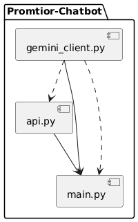

# Technical Documentation - Promtior Chatbot

## 1. Overview

This project implements a QA chatbot that uses Google Gemini to answer questions about Promtior's services. The solution integrates several components:


- **Data Loading:** Loads Promtior's information from a text file (`promtior_info.txt`).
- **Language Model:** Uses Google Gemini to generate responses based on the provided document. Google Gemini is an advanced AI model developed by Google, designed to understand context and provide accurate, human-like responses to natural language queries.

- **QA Chain:** Combines the model and vector store using a RetrievalQA chain to generate answers.

## 2. Project Structure

promtior-chatbot/
├── src/
│   ├── gemini_client.py     # Functions to connect to Google Gemini API and handle queries
│   ├── api.py               # FastAPI application and route setup
│   └── main.py              # Main application code
├── doc/
│   ├── promtior_info.txt    # Promtior information file
│   ├── UML-Component-Diagram.png  # UML component diagram
│   └── DOCUMENTATION.md     # This technical documentation
├── requirements.txt         # Project dependencies
├── Dockerfile               # Docker configuration (includes model in container)
├── Procfile                 # Defines the command to run in Railway deployment
└── runtime.txt              # Specifies Python runtime version


## 3. Installation and Execution Instructions

1. **Clone the Repository:**
   git clone https://github.com/your_username/promtior-chatbot.git

   cd promtior-chatbot
2. **Create and Activate a Virtual Environment:**

**On Windows:**
python -m venv env
.\env\Scripts\activate

**On macOS/Linux:**
python3 -m venv env
source env/bin/activate

3. **Install Dependencies:**
   pip install -r requirements.txt

4. **Model Handling (Handled in Dockerfile)**

The Google Gemini model is accessed via the API using an API key stored in the .env file. The model is used to generate responses based on the provided context.

5. **Run the Application:**

**Local Execution (Virtual Environment):**
python src/main.py

**Run with Docker:**
docker build -t promtior-chatbot .
docker run --rm -it promtior-chatbot

**Deploy in Railway:**
(See Railway-specific documentation below.)


## 4. Deployment in Railway

This project is designed to run on Railway using a Docker container. The Dockerfile ensures that all dependencies and the model are included.

The Procfile defines the entry point:
web: python src/main.py

Deployment Steps:
1. Push the latest changes to GitHub (git push origin feature/deploy).

2. Railway will automatically detect changes and redeploy the container.

3. Check logs in Railway to ensure the service starts correctly.

Railway Deploy URL:
https://promtior-chatbot-production.up.railway.app/docs

## 5. API Endpoints

This section describes the endpoints exposed by the chatbot and how to interact with them.

### 5.1. POST /ask

This endpoint receives a question in JSON format and returns an answer generated by the Google Gemini model, based on the content of `promtior_info.txt`.

#### Request

Send a POST request with a JSON body. The structure of the JSON should be:

```json
{
  "question": "Your question about Promtior."
}
Parameters:
question: The question you want to ask the chatbot. This parameter is required.
```
Example Request
Using curl:
```
curl -X POST 'https://promtior-chatbot-production.up.railway.app/ask' \
  -H 'Content-Type: application/json' \
  -d '{
        "question": "What services does Promtior offer?"
      }'
```
Response
The service will respond with a generated answer based on the content in promtior_info.txt.

Response JSON Structure:
```json
{
  "answer": "Answer generated by the model"
}
```
Example Response:
```json
{
  "answer": "Promtior offers services including AI solutions, digital transformation consulting, and implementing innovative architectures such as RAG."
}
```

### 5.2. Error Handling
If no question is provided or if the system fails to process the request correctly, the endpoint will respond with an error.

Example Error Response (422 Unprocessable Entity):
```json
{
  "error": "The 'question' field is required."
}
```
Example Error Response (500 Internal Server Error):
```json
{
  "error": "Failed to connect to Google Gemini API. Please try again later."
}
```
### Summary
The /ask API is the main endpoint for interacting with the chatbot. The Google Gemini model generates answers to questions about Promtior based on the provided content. Error handling is implemented to ensure clear responses are provided when the request is invalid or the system encounters issues.


## 6. Architecture Diagram

Below is a UML Component Diagram (UML-Component-Diagram.png) illustrating how each component (file) in the project interacts to form the chatbot:



## 7. Future Improvements

Interactive Interface: Implement a web or CLI interactive interface for dynamic queries.
Optimization: Explore using a smaller or more quantized model to improve CPU inference speed.
Robustness: Enhance error handling and add more unit tests to cover additional parts of the system.

## 8. Conclusion

This project demonstrates the integration of NLP techniques using Google Gemini, to build a QA chatbot that answers specific questions about Promtior. The modular structure, clear configuration, and inclusion of unit tests highlight adherence to good software engineering practices.
